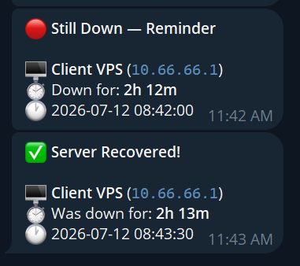
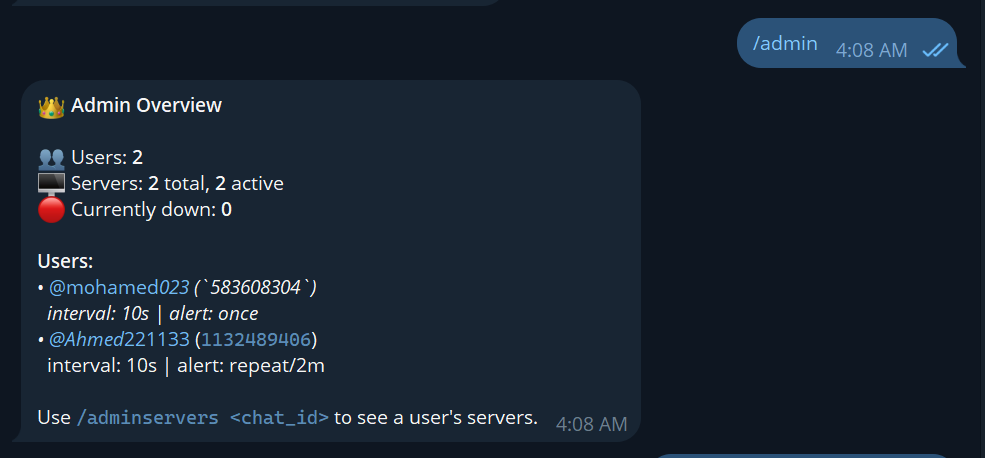
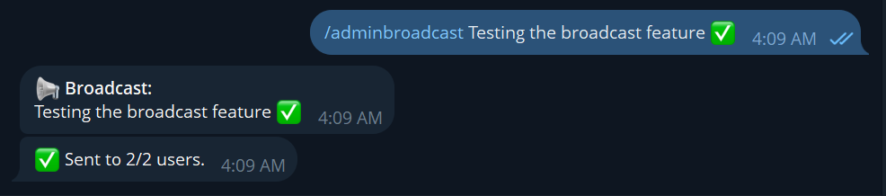
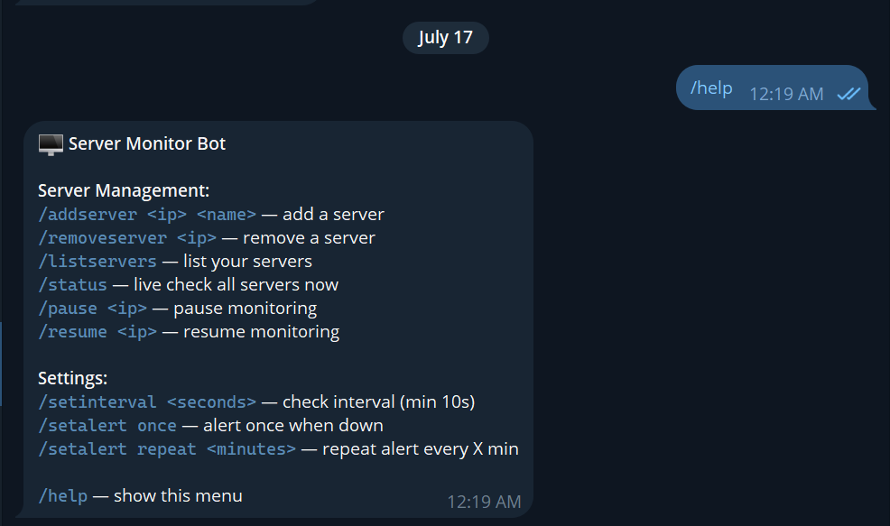

# 🖥️ Server Monitor Bot

A lightweight, self-hosted server monitoring system built with **Python** and **Ansible**, using a custom **Telegram bot** for alerts. No agents, no SSH access to monitored servers, no heavy dashboards — just fast, private, per-user uptime monitoring delivered straight to Telegram.

> Deployed on a self-hosted Ubuntu VPS, fully automated via Ansible.

---

## 📋 Overview

This project documents a from-scratch build of a private, multi-user server monitoring platform, including:

- A custom Python Telegram bot that lets each user manage their **own** list of monitored servers
- Concurrent async ping checks (no user's alerts are delayed by another user's servers)
- Flap-detection logic (requires 2 of 3 failed pings before firing an alert, to avoid false alarms from network blips)
- Configurable check interval and alert repeat frequency, per user
- Zero access required to monitored servers — pure ICMP probing from the outside
- Fully automated deployment and redeployment via Ansible + systemd

---
### Server Status


### Admin Panel


### Admin Broadcast Feature


### Help Menu


## 🏗️ Architecture

```
                    Monitoring Server (VPS)
                            │
                    ┌───────▼────────┐
                    │   bot.py       │   ← systemd service, always running
                    │ (Python async) │
                    └───────┬────────┘
             ┌──────────────┼──────────────┐
             ▼              ▼              ▼
      Telegram Bot     Async Ping      SQLite DB
      Interface         Checker      (per-user servers + settings)
      (commands)      (asyncio.gather)  
             │              │
             ▼              ▼
      Each user manages   Target Servers
      only their own      (pinged via ICMP,
      servers/alerts       no access needed)
```

Each Telegram user is fully isolated — they only see and receive alerts for servers *they* added.

---

## 🛠️ Tech Stack

| Component | Technology |
|---|---|
| OS | Ubuntu 22.04 LTS (monitoring server) |
| Language | Python 3 (`asyncio`, `sqlite3`) |
| Bot Framework | `python-telegram-bot` |
| Process Manager | systemd |
| Deployment Automation | Ansible |
| Database | SQLite (per-user servers + settings) |
| Alerting | Telegram Bot API |
| Probing Method | ICMP ping (no SSH/agent access to targets) |

---

## 📁 Repository Structure

```
server-monitor-bot/
├── README.md                       # This file
├── ansible.cfg                     # Ansible configuration
├── inventory/
│   ├── hosts.ini                   # Server inventory
│   └── group_vars/
│       └── all.yml.example         # Config template (real file is gitignored)
├── monitor-bot/
│   ├── bot.py                      # Main bot + monitoring logic
│   ├── requirements.txt            # Python dependencies
│   └── monitor-bot.service         # systemd unit file
├── playbooks/
│   └── deploy_bot.yml              # Ansible deployment playbook
└── docs/
    └── SETUP.md                    # Full step-by-step setup guide
```

---

## ⚡ Quick Start

> For full details see [docs/SETUP.md](docs/SETUP.md)

```bash
# 1. Clone the repo
git clone https://github.com/YOUR_USERNAME/server-monitor-bot.git
cd server-monitor-bot

# 2. Configure your inventory
cp inventory/group_vars/all.yml.example inventory/group_vars/all.yml
nano inventory/group_vars/all.yml   # Add your Telegram bot token, server IP, etc.
nano inventory/hosts.ini            # Add your monitoring server's IP + SSH user

# 3. Deploy — Ansible installs Python, dependencies, and the systemd service
ansible-playbook playbooks/deploy_bot.yml

# 4. Open Telegram, message your bot, and start monitoring
/start
/addserver 10.0.0.5 "My VPS"
/setinterval 30
/status
```

---

## 🤖 Bot Commands

| Command | Description |
|---|---|
| `/start` | Register with the bot |
| `/addserver <ip> <name>` | Add a server to your personal monitoring list |
| `/removeserver <ip>` | Stop monitoring a server |
| `/listservers` | List all servers you're monitoring |
| `/setinterval <seconds>` | Set how often your servers are checked |
| `/setalert <once\|repeat> <minutes>` | Choose one-time alerts or repeated reminders while down |
| `/status` | Get a live status check right now |
| `/pause <ip>` | Temporarily pause monitoring for one server |
| `/admin` *(admin only)* | See all users and how many servers each has |

---

## 🔒 Reliability Features

- **Flap detection** — a server is only marked "down" after 2 of 3 consecutive failed pings, eliminating false alarms from single dropped packets
- **Per-user isolation** — servers and alerts are scoped to each Telegram chat ID; no user can see another user's infrastructure
- **Concurrent checks** — all users' servers are pinged simultaneously with `asyncio.gather`, so no one's alerts are delayed by someone else's slow server
- **No inbound access required** — the monitored servers never need to expose SSH, agents, or open ports; the bot only sends outbound ICMP probes

---

## 🔄 Redeploying After Changes

Whenever `bot.py` is updated, push the new version with one command:

```bash
ansible-playbook playbooks/deploy_bot.yml
```

Ansible copies the updated files, reinstalls dependencies if needed, and restarts the systemd service — zero manual SSH steps.

---

## 📖 Full Setup Guide

See [docs/SETUP.md](docs/SETUP.md) for the complete walkthrough including:
- Setting up a Telegram bot via BotFather
- Getting your Telegram chat ID
- Installing Ansible and configuring SSH access
- Writing the inventory and group_vars
- Understanding the deployment playbook
- Debugging common systemd and Ansible issues encountered during the build

---

## 🧠 What I Learned

- Building a stateful, multi-user Telegram bot with `python-telegram-bot` and `asyncio`
- Designing per-user data isolation with SQLite
- Diagnosing and fixing a "flapping" alert bug caused by single dropped ICMP packets
- Writing idempotent Ansible playbooks for repeatable, hands-off deployment
- Running a Python process reliably in production with systemd (auto-restart, boot persistence)
- Iterating an architecture mid-project — replacing a heavier Prometheus/Grafana/Loki/Blackbox stack with a simpler, purpose-built solution once the actual requirements became clear
- Handling real client constraints (no SSH access to production servers) by designing around outbound-only probing

---

## 📜 License

MIT — feel free to use this as a reference for your own self-hosted monitoring setup.
